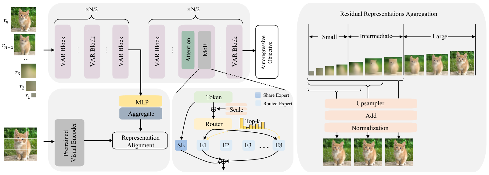
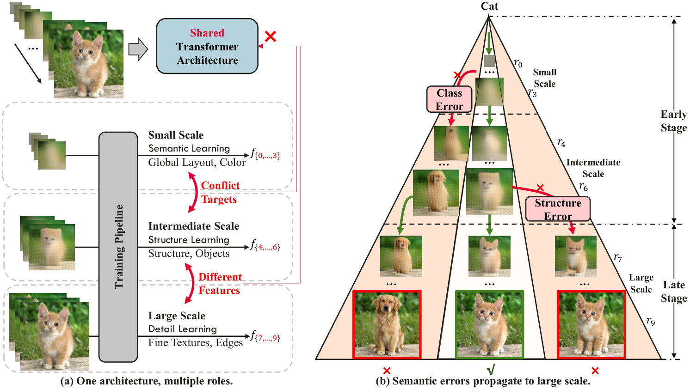
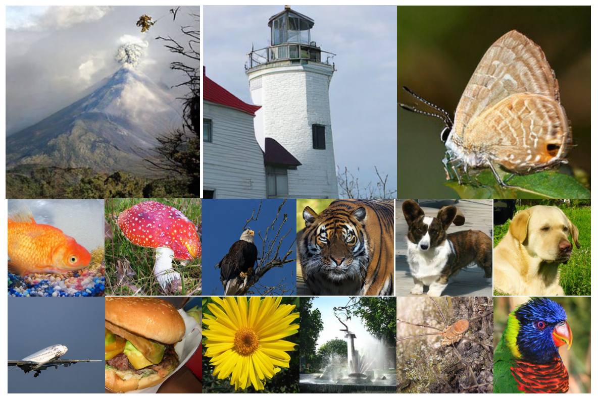

# MEPA: Multi-Scale Representation Alignment for Visual Autoregressive Modeling with Mixture of Experts


<p align="center">
  <strong>English</strong> | <a href="README_zh.md">中文</a>
</p>

<p align="center">
  <a href="https://arxiv.org/abs/2607.00371">
    
  </a>
  <a href="https://arxiv.org/pdf/2607.00371">
    
  </a>
  
  
</p>

<p align="center">
  Nuoyan Zhou, Zhijun Tu, Lei Yu, Kun Cheng, Jie Hu, Nannan Wang, Xinghao Chen
  
</p>

This repository is a reproduction of Multi-Scale Representation Alignment for Visual Autoregressive Modeling with Mixture of Experts(**MEPA**), an **ECCV 2026** work which improves both **training efficiency** and **generation quality** of Visual AutoRegressive (VAR) modeling.


## Contributions

VAR has pioneered a coarse-to-fine autoregressive modeling via next scale prediction. The paper observes two limitations in vanilla VAR:

- **Scale conflict:** lower scales mostly learn global semantics, while higher scales model fine details; sharing one dense FFN stack across all scales can cause optimization conflicts.
- **Semantic error propagation:** because later scales condition on earlier predictions, wrong semantics at small/intermediate scales can be amplified in the final image.

MEPA addresses these issues by combining:

1. **Scale-aware token-routed Mixture-of-Experts (STMoE)** for decoupled multi-scale representation learning.
2. **Semantic Guidance (SG)** from a pretrained self-supervised visual encoder to strengthen early/intermediate-scale semantics.

<p align="center">
  
</p>


## Installation

1. Install PyTorch.  The original VAR code expects `torch>=2.0`; this reproduction was tested around the `torch~=2.1.0` dependency in `requirements.txt`.
2. Install Python dependencies:

```bash
pip install -r requirements.txt
```

Optional acceleration packages:

```bash
pip install flash-attn xformers
```

If these packages are installed, the attention/MLP code will use faster fused kernels where available.

## Dataset

Prepare ImageNet-1K in the standard folder format:

```text
/path/to/imagenet/
  train/
    n01440764/
      *.JPEG
    ...
  val/
    n01440764/
      *.JPEG
    ...
```

Pass the path with `--data_path=/path/to/imagenet`.

## Pretrained Models
###
  ~./code/
  ├── MEPA-main/
  │   ├── train.py
  │   ├── models/
  │   ├── vae_ch160v4096z32.pth (download from https://huggingface.co/FoundationVision/var/)
  │   │   ├── dinov3_loader.py
  │   │   └── ...
  │   └── ...
  ├── dinov3/ (git clone https://github.com/facebookresearch/dinov3.git)
  │   ├── hubconf.py
  │   ├── dinov3/
  │   └── ...
  └── pretrained_models/
      ├── your_dinov3_weight_file.pth (hf download facebook/dinov3-vitb16-pretrain-lvd1689m)
      └── ...
###


## Training


```bash
# MEPA-d16, ImageNet 256×256, 100 epochs
torchrun --nproc_per_node=8 train.py \
  --data_path=/path/to/imagenet \
  --depth=16 \
  --pn=256 \
  --bs=96 \
  --ep=100 \
  --tblr=1e-4 \
  --twd=0.05 \
  --wpe=0.1 \
  --fp16=1 \
  --alng=1e-3 \
  --enc_type=dinov3-vit-b16 \
  --align_start=5 \
  --align_end=7
# MEPA-d12. Use `--depth=12`. 
# MEPA-d20, ImageNet 512×512, 200 epochs
torchrun --nproc_per_node=8  train.py \
  --depth=20 \
  --saln=1 \
  --pn=512 \
  --bs=96 \
  --ep=200 \
  --tblr=8e-5 \
  --fp16=1 \
  --alng=5e-6 \
  --wpe=0.01 \
  --twde=0.08 \
  --enc_type=dinov3-vit-b16 \
  --align_start=5 \
  --align_end=7
```


## Sampling and evaluation

Sampling follows the original VAR API.  For class-conditional ImageNet evaluation, use:

```python
var.autoregressive_infer_cfg(
    B=B,
    label_B=label_B,
    cfg=1.5,
    top_p=0.96,
    top_k=900,
    more_smooth=False,
)
```

For FID/IS/Precision/Recall, generate 50,000 PNG images and evaluate with the standard ImageNet reference statistics, as in the original VAR evaluation protocol.

## Implementation notes

This codebase modifies the following modules:

| File | Main change |
|---|---|
| `models/moe.py` | Implements `MoEGate`, load-balance auxiliary loss, and `SparseMoeBlock` with routed FFN experts plus a shared expert. |
| `models/basic_var.py` | Adds `AdaLNSelfAttn_MoE`, replacing the dense FFN branch of a VAR block with `SparseMoeBlock`. |
| `models/var.py` | Uses MoE blocks by default; adds a middle-layer projector that maps VAR hidden states to a 768-D feature space for semantic guidance. |
| `utils/arg_util.py` | Adds MEPA-specific arguments: `--enc_type`, `--align_start`, and `--align_end`. |
| `utils/load_encoder.py` | Provides a unified wrapper for pretrained visual encoders such as DINO/DINOv2/DINOv3/MoCoV3/MAE/CLIP/SigLIP/etc. |
| `train.py` | Loads the external encoder and passes it into `VARTrainer`. |
| `trainer.py` | Computes the standard VAR token cross-entropy plus the semantic alignment loss over selected residual scales. |

- This repository is a reproduction branch, not the original VAR release.
- The default `--enc_type` in `utils/arg_util.py` is currently `dinov3`; for `utils/load_encoder.py`, pass a full three-part spec such as `dinov3-vit-b` or `dinov2-vit-b`.
- If you change the external encoder dimensionality, update `models/var.py`'s `projector` output dimension and the alignment reshape logic in `trainer.py`.
- STMoE hyperparameters are currently hard-coded in `models/moe.py` (`num_experts=8`, `num_experts_per_tok=2`, `aux_loss_alpha=0.01`).
- The current MoE implementation uses a shared expert in addition to routed experts, matching the paper's idea of maintaining common capacity while specializing routed capacity.


## Main results from the paper

<p align="center">
  
</p>

### ImageNet 256×256


| Model | FID ↓ | IS ↑ | Precision ↑ | Recall ↑ | Params | Steps | Epochs |
|---|---:|---:|---:|---:|---:|---:|---:|
| VAR-d16 | 3.55 | 280.4 | 0.84 | 0.51 | 310M | 10 | 200 |
| VAR-d20 | 2.95 | 302.6 | 0.83 | 0.56 | 600M | 10 | 250 |
| FlexVAR-d16 | 3.05 | 291.3 | 0.83 | 0.52 | 310M | 10 | 180 |
| FlexVAR-d20 | 2.41 | 299.3 | 0.85 | 0.58 | 600M | 10 | 250 |
| SpectralAR-d16 | 3.02 | 282.2 | 0.81 | 0.55 | 310M | 64 | 200 |
| SpectralAR-d20 | 2.49 | 305.4 | - | - | 600M | 64 | 250 |
| **MEPA-d12** | **2.86** | **288.44** | 0.82 | 0.55 | 252M | 10 | 200 |
| **MEPA-d16** | **2.32** | **311.26** | 0.82 | 0.57 | 585M | 10 | 200 |
| VAR-d16 reproduced | 4.10 | 241.6 | 0.85 | 0.47 | 310M | 10 | 100 |
| FlexVAR-d16 reproduced | 7.68 | 176.63 | 0.77 | 0.49 | 310M | 10 | 100 |
| FlexVAR-d20 reproduced | 5.77 | 215.04 | 0.77 | 0.52 | 600M | 10 | 100 |
| **MEPA-d12** | **3.27** | **260.97** | 0.81 | 0.53 | 252M | 10 | 100 |
| **MEPA-d16** | **2.65** | **304.60** | 0.82 | 0.56 | 585M | 10 | 100 |


### ImageNet 512×512

Due to limited computational resources, MEPA-d20 is trained for only 66 epochs and does not fully converge.


| Model | BigGAN | ADM | DiT-XL/2 | MaskGIT | VQGAN | VAR-d36-s | **MEPA-d20** |
|---|---:|---:|---:|---:|---:|---:|---:|
| FID ↓ | 8.43 | 23.24 | 3.04 | 7.32 | 26.52 | **2.63** | 7.29 |
| IS ↑ | 177.9 | 101.0 | 240.8 | 156.0 | 66.8 | **303.2** | 199.2 |
| Epoch | - | - | - | - | - | 350 | 66 |


## Acknowledgements

This repo is built upon the excellent [VAR](https://github.com/FoundationVision/VAR), [REPA](https://github.com/sihyun-yu/REPA), [DiT-MoE](https://github.com/feizc/DiT-MoE). Thanks Codex for writing this high-quality README file.


## Citation

If this reproduction or the MEPA paper helps your research, please cite the paper:

```bibtex
@misc{mepa2026,
  title         = {Multi-Scale Representation Alignment for Visual Autoregressive Modeling with Mixture of Experts},
  author        = {Zhou, Nuoyan and Tu, Zhijun and Yu, Lei and Cheng, Kun and Hu, Jie and Wang, Nannan and Chen, Xinghao},
  year          = {2026},
  eprint        = {2607.00371},
  archivePrefix = {arXiv},
  primaryClass  = {cs.CV},
  url           = {https://arxiv.org/abs/2607.00371}
}
```

